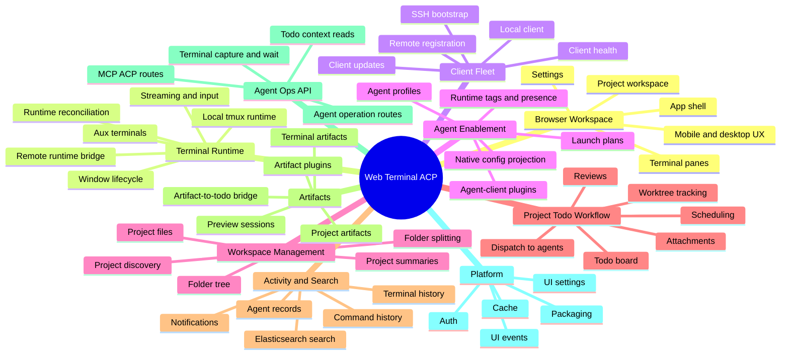

# Web Terminal ACP Capability Map

本文档按产品能力而不是代码目录描述 Web Terminal ACP。它用于快速回答三件事：系统能做什么、这些能力之间如何协作、主要实现边界在哪里。

## L0 Capability

Web Terminal ACP 是面向 shell 和 AI coding agent 工作流的浏览器控制平面。它把本机或远程机器上的 tmux 终端、agent-client、项目 todo、产物、历史记录、搜索和审查结果组织成可恢复、可追踪、可分派的工作空间。

## L1 Capability Map

## Capability Inventory

| Capability | User outcome | Primary surfaces | Main backend owner | Main persistence / runtime |
| --- | --- | --- | --- | --- |
| Browser workspace | Users navigate clients, folders, projects, terminals, details, overlays, settings, and mobile shortcuts from one UI. | `frontend/src/App.tsx`, `components/AppShellMain.tsx`, sidebar, toolbar, detail panel, overlays | Cross-context API composition | Browser state, React Query, UI settings |
| Terminal runtime | Users create, reconnect to, type into, stream from, clone, delete, and recover terminal sessions. | Terminal pane, terminal switcher, terminal drawer, create modal, quick input | `contexts/terminal_runtime`, `contexts/windows` | tmux, PTY control, WebSockets, `virtual_windows`, terminal output events |
| Client fleet | Users run shells on the server host or registered remote machines. | Client switcher, client list, add client modal, bootstrap and registration key forms | `contexts/clients` | `clients`, `client_registration_keys`, client-agent WebSocket registry |
| Agent enablement | Users launch and configure Claude Code, Codex, Cursor CLI, and compatible agent-clients through reusable profiles. | Terminal create modal, Settings -> Agents, system agent config screens | `contexts/agent_profiles`, `contexts/windows`, `platform.plugins.agent_plugins` | `~/.web-terminal-acp/agents`, native agent homes, plugin descriptors |
| Workspace management | Users organize terminal work by folder and project, browse project files, and generate project summaries. | Folder tree, project detail, project file browser, project summary views | `contexts/workspace` | `folders`, `project_summaries`, host filesystem, summary jobs |
| Project todo workflow | Users maintain project todo boards, dispatch cards to agents, review work, attach files, schedule recurring work, and track worktrees. | Project todo panel, board cards, dispatch/review modals, schedule controls, attachments | `contexts/workspace`, `contexts/windows`, `contexts/terminal_runtime` | `project_todos`, types, runs, reviews, attachments, dependencies, worktree rows |
| Activity and history | Users inspect terminal activity, command history, title history, AI sessions, agent records, work status, recents, and notifications. | Agent record viewer, command/title history viewers, work status badges, notification center, search panels | `contexts/activity`, `contexts/windows`, `platform.ingest`, `platform.search_index` | `events`, `ai_sessions`, terminal recents, Elasticsearch indexes |
| Artifacts | Users create, view, preview, link, and retry terminal/project artifacts such as review cards, reports, traces, and HTML previews. | Artifact drawer, quick open, project artifacts panel, artifact iframe bridge, Settings -> Artifact plugins | `contexts/terminal_artifacts`, `platform.plugins.artifact_plugins` | `terminal_artifacts`, artifact preview sessions, artifact plugin storage |
| Agent operations API | Agents and tools can operate terminals, capture output, wait for text, read todo context, and inspect artifacts programmatically. | MCP/ACP endpoints and `/api/agent-ops/*` routes | `contexts/mcp_acp` | Existing terminal, workspace, and artifact services |
| Platform services | The app provides auth, settings, invalidation events, search infrastructure, cache support, and release surfaces. | Login gate, settings pages, UI event socket, Docker/Electron/Android entrypoints | `platform`, root app bootstrap, frontend packaging | PostgreSQL, Elasticsearch, Redis/cache, Docker, Electron, Capacitor |

## Deeper Capability Breakdown

### 1. Browser Workspace

- Maintains the main app layout: client/project navigation, terminal viewport, terminal drawer, detail panel, overlays, modals, onboarding, mobile shortcuts, and immersive terminal mode.
- Coordinates authenticated data fetching, route-like UI state, query invalidation over the UI event socket, keyboard shortcuts, quick keys, theme skins, locale, and desktop notifications.
- Keeps terminal interaction ergonomic on desktop and mobile through quick input, virtual keys, touch handling, responsive layout, and focused refit behavior.

### 2. Terminal Runtime

- Creates windows against a selected client, cwd, shell command, agent-client, or agent profile.
- Supports local tmux-backed sessions and remote client-agent sessions through a shared terminal runtime abstraction.
- Streams terminal bytes over WebSocket, records output and input markers, tracks terminal selection, supports aux terminals, and exposes capture/wait operations for agents.
- Reconciles stale windows, missing tmux windows, offline remote clients, runtime bindings, and agent worktree markers.

### 3. Client Fleet

- Guarantees a local client record at startup and tracks remote clients by token, status, runtime, version, hostname, install path, and last seen timestamps.
- Supports direct registration with one-time keys and a generated install script.
- Supports SSH bootstrap when the server is allowed to connect to a remote host.
- Provides client update packages and update completion callbacks for remote client self-update flows.
- Uses client-agent WebSockets to list remote agent-client capabilities, create sessions, route input/output, and mark connectivity.

### 4. Agent Enablement

- Models executable tools as agent-client plugins with launch commands, aliases, provider ids, storage/config metadata, capability flags, watcher collectors, and optional server-side record adapters.
- Provides reusable agent profiles under `~/.web-terminal-acp/agents/<profile-id>` with common `AGENT.md`, shared skills, disabled skills, and projected native client config.
- Lets users manage system-level skills, MCP entries, model presets, native config items, and per-profile config from Settings.
- Builds launch plans for direct agent-client selection or profile-based launches, including local/remote capability checks.

### 5. Workspace Management

- Organizes terminal windows into per-client folder trees with stable folder paths and manual override handling.
- Discovers projects from browse roots, exposes project details, lists files, previews file content, downloads files, and uploads/updates project files.
- Generates project summaries and terminal summaries through background workers and OpenAI-compatible summarization.
- Splits overloaded folders through a background folder-split worker.

### 6. Project Todo Workflow

- Manages todo cards by client and project with statuses, hierarchy, sort order, todo types, agent/profile defaults, artifact expectations, and review metadata.
- Dispatches cards to implementation terminals using selectable terminal policies and prompt templates.
- Tracks dispatch runs, retry/failure state, comments, annotations, attachments, linked artifacts, work snapshots, review targets, review runs, and unseen review state.
- Supports manual and scheduled/recurring execution through a periodic scheduler.
- Reconciles implementation worktrees so todo cards can show branch/worktree state produced by agents.

### 7. Activity, Records, And Search

- Ingests terminal output/input events, Claude JSONL, Codex traces, and generic agent tool records into normalized event and AI session rows.
- Projects agent records into chat/detail/search views and derives work presence, activity timestamps, runtime tags, command history, title history, and terminal recents.
- Sends terminal notifications and UI invalidation events so the frontend can update without polling every surface.
- Indexes terminal chunks, AI events, and summaries into Elasticsearch for global and per-client search.

### 8. Artifacts

- Creates terminal-scoped and project-scoped artifacts, tracks pending/running/completed/failed states, stores structured JSON plus rendered HTML, and reconciles interrupted generation at startup.
- Supports built-in and managed artifact plugins for reviews, reports, traces, page review cards, and ACAS-style project artifacts.
- Provides preview sessions so plugin authors can iterate on demo data and HTML rendering.
- Lets artifact iframes create project todo cards through a controlled bridge.

### 9. Agent Ops API

- Exposes machine-friendly MCP/ACP and `/api/agent-ops/*` routes for listing clients/windows, creating windows, sending input, capturing output, waiting for output, reading project todo context, and retrieving artifacts/previews.
- Reuses canonical application services rather than duplicating terminal, workspace, or artifact behavior.

### 10. Platform And Distribution

- Provides optional built-in auth, UI settings persistence, UI event hub, cache/polling helpers, search index setup, and versioned FastAPI startup.
- Packages the server and frontend through Docker; packages the UI as Electron desktop and Capacitor Android apps.
- Builds a slim remote-client bundle; any runtime import needed before connection must be included in the bootstrap installer bundle list.

## Capability Collaboration Flows

### Create And Use A Terminal

1. User selects a client, folder/project context, cwd, shell command, agent-client, or agent profile in the frontend.
2. `windows` validates the launch request and creates a `virtual_windows` record.
3. `terminal_runtime` starts or attaches to local tmux or asks the remote client-agent to create a session.
4. The terminal WebSocket streams server terminal bytes to xterm.js and sends user input back to the runtime.
5. `activity` records output/input markers, recents, command history, presence, and notifications.

### Dispatch A Project Todo To An Agent

1. User creates or selects a todo card in a project board.
2. `workspace` resolves todo type defaults, prompt references, attachments, review config, and terminal policy.
3. `windows` and `terminal_runtime` create or select the implementation terminal and launch the requested agent-client/profile.
4. `activity` and `workspace` track agent progress, run status, worktree state, linked artifacts, comments, and review state.
5. Optional review dispatch creates review runs and artifacts, then marks cards for human follow-up when needed.

### Generate And Review An Artifact

1. User or agent requests an artifact for a terminal or project context.
2. `terminal_artifacts` schedules generation and uses the selected artifact plugin to produce structured content and display HTML.
3. The frontend renders artifacts in drawers, panels, quick open, or iframe previews.
4. Project todo bridges can turn artifact cards into todo cards, preserving the originating artifact context.

## Boundaries And Ownership Rules

- New business behavior belongs in the owning `backend/app/contexts/<context>/` module, not legacy horizontal facades.
- Cross-context calls should use another context's application service or public DTO/projection, not its infrastructure repository.
- `backend/app/platform/` owns auth, search, UI events/settings, cache, ingest helpers, and plugin registries.
- Terminal display correctness depends on the server terminal byte stream as the source of truth; UI optimizations must not invent, reorder, or discard terminal bytes.
- Remote client startup is constrained by the slim bundle in `bootstrap_installer.py`; new pre-connection imports must be packaged and covered by isolated bundle tests.
